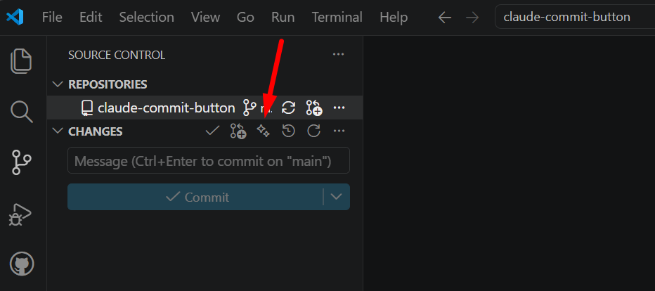
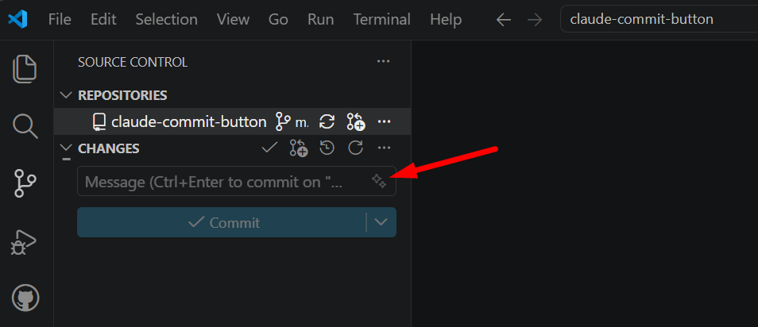

# Claude Commit Button

Generate git commit messages with the [Claude CLI](https://docs.claude.com/en/docs/claude-code), straight from VS Code's Source Control panel.

A ✨ button appears in the Source Control toolbar. Click it: the extension reads your diff (staged, or the whole working tree if nothing is staged), asks Claude for a concise commit message, and fills the commit input box.



## Requirements

- The [Claude CLI](https://docs.claude.com/en/docs/claude-code) installed and authenticated (`claude --version` should work in your terminal).

## Install

1. Download the `.vsix` from the [Releases](https://github.com/toledox82/claude-commit-button/releases) page.
2. In VS Code: `Ctrl+Shift+P` → **Extensions: Install from VSIX…** → pick the file.
3. Reload the window.

## Usage

Open the Source Control panel and click the ✨ button next to **CHANGES**.

## Settings

| Setting                      | Default  | Values                                  | Description                                            |
| ---------------------------- | -------- | --------------------------------------- | ------------------------------------------------------ |
| `claudeCommitButton.cliPath` | `""`     | any path                                | Path to the Claude CLI. Empty = auto-detect from PATH. |
| `claudeCommitButton.model`   | `sonnet` | `haiku`, `sonnet`, `opus`, `fable`      | Model used to generate the message.                    |
| `claudeCommitButton.effort`  | `low`    | `low`, `medium`, `high`, `xhigh`, `max` | Effort level.                                          |

## Optional: button inside the message box

You can move the button _inside_ the commit message box (Copilot-style) instead of the toolbar.



This needs VS Code's proposed `scm/inputBox` API, so it **only works locally** (it can't be shipped in the `.vsix`) and requires a one-time manual setup:

1. In the installed extension's `package.json`, add the proposed API:
   ```json
   "enabledApiProposals": ["contribSourceControlInputBoxMenu"],
   ```
   and a `scm/inputBox` menu entry mirroring the `scm/title` one.
2. Add the extension id to `~/.vscode/argv.json`:
   ```json
   "enable-proposed-api": ["marciotoledo.claude-commit-button"]
   ```
3. Fully restart VS Code (not just "Reload Window").

After this setup an extra setting becomes available:

| Setting                             | Default | Values         | Description                                                          |
| ----------------------------------- | ------- | -------------- | -------------------------------------------------------------------- |
| `claudeCommitButton.buttonLocation` | `input` | `input`, `top` | Where the button appears: inside the message box, or in the toolbar. |

> This setting does nothing in the default `.vsix` build — it only takes effect once the proposed-API setup above is in place.

## Support

If this little ✨ button saved you some time and you'd like to give back, you can [buy me a coffee ☕](https://donate.stripe.com/9AQ7sCbcPg9963e5kl). Another way to help is to use one of the [referral links on my site](https://marciotoledo.com/links?ref=claude-commit-button) when signing up for services I recommend. It's totally optional and very appreciated — thanks! 😊

## License

MIT © [Marcio Toledo](https://marciotoledo.com/?ref=claude-commit-button)
